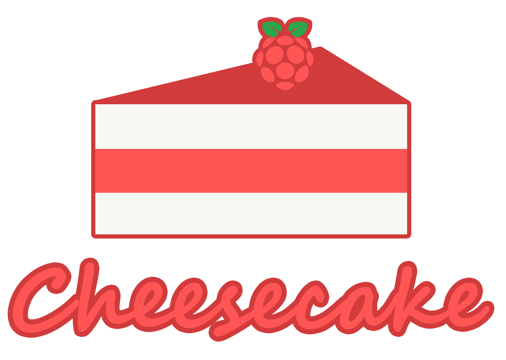

<p align="center">
  
</p>

<h4 align="center">
  Cheesecake is the best option for Raspberry Pi with Nodejs!
</h4>

## 📖 Overview

This package was created to help Nodejs developers create projects to work with the Raspberry PI GPIO pins in a simple way. Why did I choose this name? Because I ❤️ cheesecake and that's enough! :D

## ‍🚀 Installation

Just add cheesecake to your Nodejs project for Raspberry Pi:

```sh
$ npm i cheesecakejs --save
```

## 👨🏽‍💻 Example

```js
const { Gpio, GpioValue, GpioDirection } = require('cheesecakejs');

const gpio4 = new Gpio(4, GpioDirection.OUT);

gpio4.onValueChanged((data) => {
  const dateTime = new Date().toJSON();
  console.log(`${dateTime} - Gpio${gpio4.gpio}: new value => ${data}`);
});

setInterval(() => {
  const value = gpio4.getValue();
  gpio4.setValue(Boolean(value) ? GpioValue.LOW : GpioValue.HIGH);
}, 1000);

process.on('SIGINT', () => {
  console.log('Please, await...');
  gpio4.dispose();
  process.exit();
});
```

## 📕 GPIO Pins Diagram

A powerful feature of the Raspberry Pi is the row of GPIO pins along the top edge of the board.


<small>
REFERENCE: <a href="https://www.raspberrypi.org/documentation/usage/gpio/">https://www.raspberrypi.org/documentation/usage/gpio/</a>
</small>

## 📃 Contributing

Thanks for your interest on our project. Take a moment to read our guidelines:

- [Contributing](./.github/CONTRIBUTING.md)
- [Code of Conduct](./.github/CODE_OF_CONDUCT.md)

## 📮 Contact

We have a few channels for contact:

- Email: [dev@thiagosouza.com](mailto:dev@thiagosouza.com)
- [GitHub Issues](https://github.com/thiagodesouza/cheesecake/issues)

## 📃 License

MIT © [Cheesecake](https://github.com/thiagodesouza/cheesecake/)
